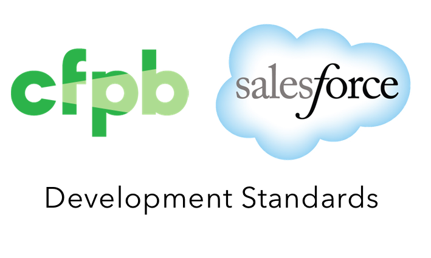

**Status**:  Live "production" version 2.0.1  
  - [CHANGELOG](CHANGELOG.md).

### Purpose and Scope

**This documentation describes guidelines for how applications in Salesforce should be built and deployed at the CFPB. The intended audience are Salesforce developers, administrators, and release managers.**

It establishes the standards, controls, and guidance
that enforce technical quality of the platform and product work that goes into CFPB’s Salesforce platform. It also describes the primary interfaces between the Enterprise Platforms Team (aka the CoE - Center of Excellence)
and the various Product Teams building application solutions on the Salesforce platform.

#### What this **is**:
 - Best practices for developing applications on the Salesforce platform
 - Coding standards
 - Automated testing standards
 - Security best practices
 - Deployment pipelines practices (continuous integration)

#### What this is **not**:
 - Specific to the CFPB's operating environment
 - Operational instructions for how to get support; e.g., how to set up a developer sandbox; how to reset your password
 - How to integrate with third-party systems
 - A list of CFPB applications or products

### Goals

1. Provide a canonical reference for technical standards and guidelines
1. Assure only high quality software is built and deployed to CFPB’s Salesforce platforms
1. Maintain confidence in the deployment process and a high degree of availability for the CFPB salesforce org
1. Establish efficient developer workflows and share knowledge and practices across product development teams
1. Minimize operational burden for the Salesforce Platform Admin Team and the CFPB at large
1. Provide pertinent information to partners and vendors

### Salesforce Governance

#### 1. Charter, Roles, and Operations
- [Roles & Responsibilities](/_pages/roles-&-responsibilities.md)
- [Salesforce Platform Charter](/_pages/mission-vision.md)
- [Operations](/_pages/operations.md)

#### Standards

Note that technical design and implementation is reviewed by the Software Advisory Group (SwAG) 
and signed off by the Principal Architect and the CoE.

- [FAQs](/_pages/FAQs.md)
- [T&I Org Structure](/_pages/Org-Chart.md)
- [Architectural View](/_pages/architecture-view.md)
- [Security Model (Permission Sets, Profiles)](/_pages/Security-Model-(Permission-Sets,-Profiles).md)
- [Sharing & Security](/_pages/Record-Level-Sharing.md)
- [Software, Architecture, Data, and Visual Design Standards References]
- [Technical Approach](/_pages/Technical-Approach.md)
- [Agile Methodology](/_pages/Agile-Methodology.md)
- [Center of Excellence (COE)](/_pages/Center-of-Excellence.md)
- [Software Advisory Group (SwAG)](/_pages/SoftWare-Advisory-Group.md)
- [Salesforce Best Practices](/_pages/Salesforce-Best-Practices.md)
- [Exception Handling](/_pages/Exception-Handling.md)
- [Testing & Debugging](/_pages/Testing-&-Debugging.md)
- [Logging & Troubleshooting](/_pages/Logging-&-Debugging.md)
- [Appendices](/_pages/Appendices.md)

----

### Get involved

Any feedback and contributions are welcome! 

Please familiarize yourself with the [CONTRIBUTING](CONTRIBUTING.md). Then, make suggestions for edits, report issues, etc., in the [issues section](/issues) of this repository.

### Open source licensing info
1. [TERMS](TERMS.md)
2. [LICENSE](LICENSE.md)
3. [CFPB Source Code Policy](https://github.com/cfpb/source-code-policy/)

----

## Credits and references

1. TODO

----
