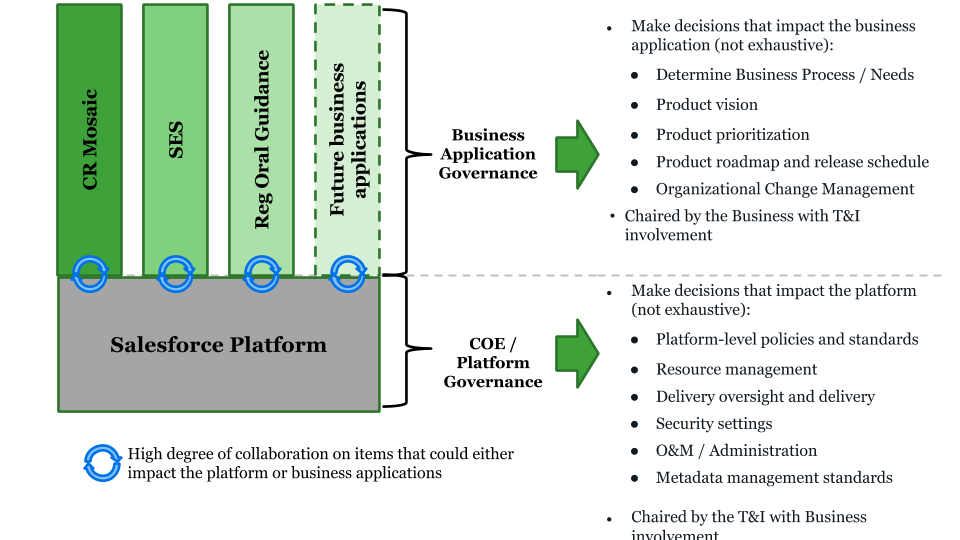

###Business Application vs. Platform Governance

Decisions associated with business applications and the platform should be governed by the appropriate governing body with sufficient T&I and/or business line representation.

